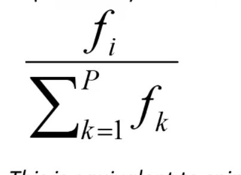
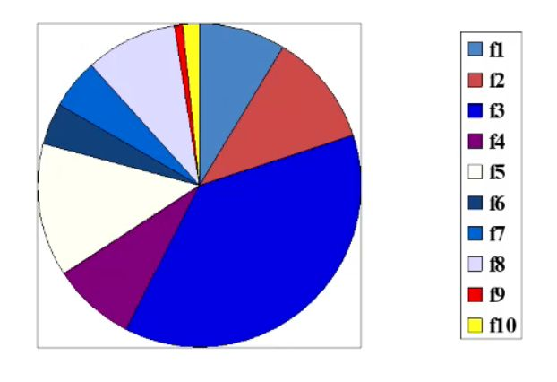

# explain Fitness Proportionate Selcection (Roulette wheel)

<b>Reveal answer</b>

Fitness Proportionate Selcection - probability of selection is increased with better fitness fitness / total fitness   

