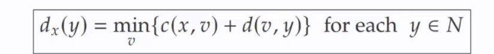

# Basic idea of DV algorithm (steps)

<b>Reveal answer</b>

1. Each node periodically sends its own DV to neighbours 2. When a node x receives a new DV from its neighbours, it update sits own DV using the B-F equation  3. Dx(y) naturally converges to the least cost

