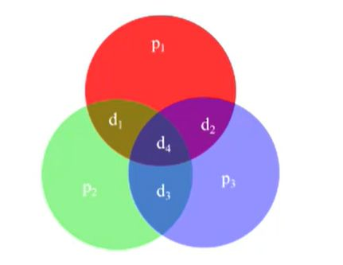
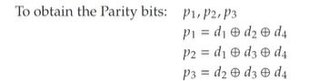

## Hamming code explained (using 4 input bits). How to calculate partiy bits of p1, p2, p3?

<b>Reveal answer</b>

  Input data d1, d2, d3, d4 Parity bits p1, p2, p3  Then we output as p1, p2, d1, p3, d2, d3, d4  ^ POSITIONS that are powers of 2 are reserved for parity bits!

