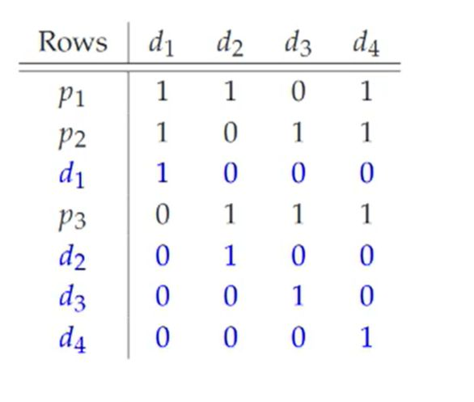

## What does the Generator matrix G look like?

<b>Reveal answer</b>

 &nbsp; &nbsp; &nbsp;d1&nbsp; d2&nbsp; d3&nbsp; d4 p1 1&nbsp; &nbsp; 1&nbsp; &nbsp; 0&nbsp; &nbsp; 1 p2 1&nbsp; &nbsp; 0&nbsp; &nbsp; 1&nbsp; &nbsp; 1 d1 1&nbsp; &nbsp; 0&nbsp; &nbsp; 0&nbsp; &nbsp; 0 p3 0&nbsp; &nbsp; 1&nbsp; &nbsp; 1&nbsp; &nbsp; 1 d2 0&nbsp; &nbsp; 1&nbsp; &nbsp; 0&nbsp; &nbsp; 0 d3 0&nbsp; &nbsp; 0&nbsp; &nbsp; 1&nbsp; &nbsp; 0 d4 0&nbsp; &nbsp; 0&nbsp; &nbsp; 0&nbsp; &nbsp; 1

