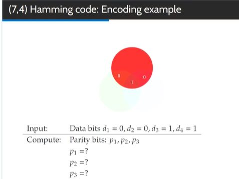
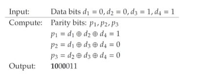

## &nbsp;What is the message that is sent?

<b>Reveal answer</b>

p1 = d1 xor d2 xor d3 p2 = d1 xor d3 xor d4 p3 = d2 xor d3 xor d4  p1 = 1 p2 = 0 p3 = 0  p1, p2, d1, p3, d2, d3, d4 out = <b>100</b>0011 ^ REMEMBER, WE ADD IT ONTO THE START 

