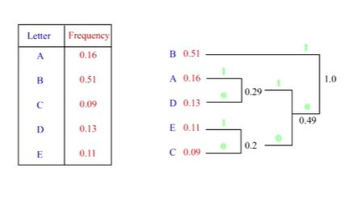

## huffman encoding algorihtm

<b>Reveal answer</b>

1. Sort symbols by their probability pi in decreasing order. Repeat: 1. Start from the two symbols with the smallest probabilities: &nbsp;- Sum the probabilities of the two symbols to to create a new virtual symbol. - Assign 0 to one of the two joined symbols, and 1 to the other 3. terminate if the sum of the two symbols sums to 100%  

