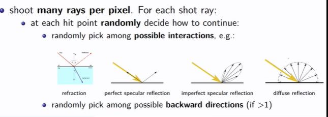

## Whats a benefit of random sampling for path tracing? 

<b>Reveal answer</b>

Random samply: pick randomly form refraction, perfect specular reflection, imperfect specular reflection, diffuse reflection  1. Efficiency 2. You capture indirect lighting by considering all interactions -- achieve global illumination

