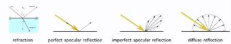

## What intereactions does path tracing consider&nbsp;

<b>Reveal answer</b>

<ul><li>refraction</li><li>perfect specular reflection</li><li>imperfect specular refleciton</li><li>diffuse reflection</li></ul> 

