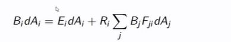

## Radiosity theory, what are each of the variables 

<b>Reveal answer</b>

Bi: radiosity at patch i dAi: area at patch i  Ei: Emitted energy per unit area from patch i  Ri: Reflective coefficient of patch i Fji: Form factor from patch j to i

