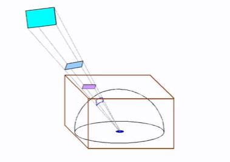
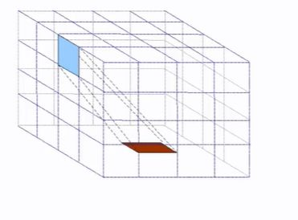

## What is the hemicube method?

<b>Reveal answer</b>

 An approximation of form factor All patches that project onto the same area of the hemisphere have the same form factor... Use a cube as an esmitiation of the sphere 

