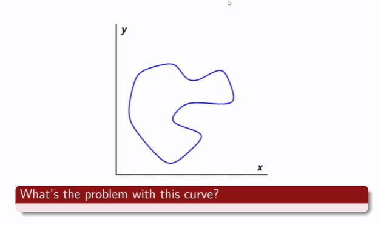
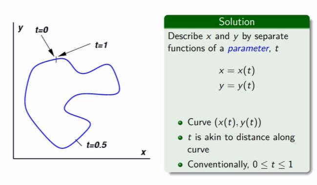

## above, and solution

<b>Reveal answer</b>

One x input can have more than one output Cannot be represented by y=f(x)  Solution:&nbsp; Use another parameter to represent x and y, t where it represents the distance along the perimeter 0 &lt;= t &lt;=1  x = x(t) y = y(t)  t is the perimeter 

