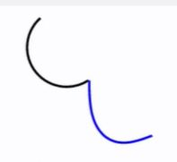
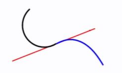
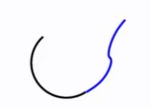

## smoothness at the join: C continuity explained (3 types)

<b>Reveal answer</b>

C0 continuity: segments meet   C1 continuity: segments meet and tangents are equal (first derivates are equal)   C2 continuity: first and second derivatives are equal 

