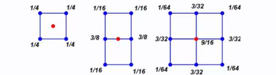

## Catmull clark subdivision on rectangular grids  

<b>Reveal answer</b>

New vertices may occur on a face, on an edge, or at an original vertex  <b>C2 continuity</b> except at <b>extraordinary points where C1 contiuity </b>is achieved with special choices of weight

