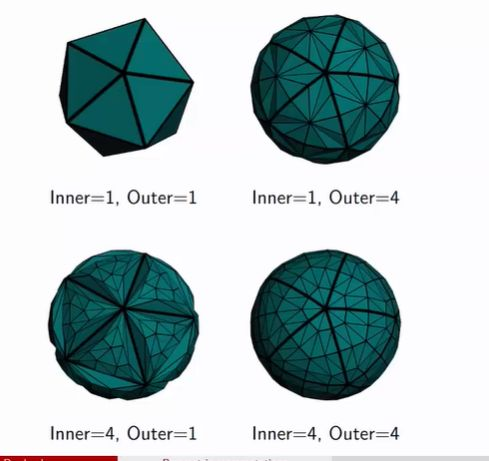

##  Compare inner and outer levels

<b>Reveal answer</b>

1, 1: no tesselation original shape 1,4: Only outer edges get subdivided 4,1: Only inner edges get subdivided 4,4: High detial, both get subdivided

