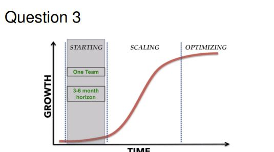
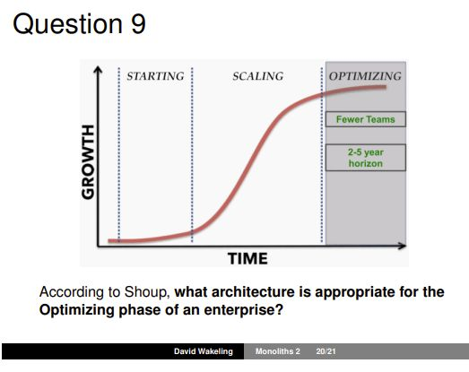

## According to Shoup, what architecture is appropriate for the starting phase of an enterprise? 

<b>Reveal answer</b>

A monolithic one that is ""just enough"" to meet near-term, evolving customer needs as cheaply as possible

## According to Shoup, what architecture is appropriate for the Optimising phase of an enterprise? 

<b>Reveal answer</b>

One that is - More stable - Sustainable - Has incremental improvements in functionality and efficiency

