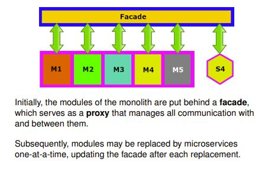

## Explain Fowler's The Strangler Design Pattern

<b>Reveal answer</b>

How teams might migrate from a monolithic MVP to a microservices one.  Put a facade in front of the monolith which serves as a proxy that manages all communication between them, then slowly replace the modules behind it. If one fails, just change the facade to route back to the modules. Go one at a time. 

