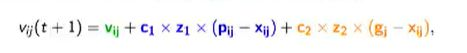

## PSO how to determine the new velocity?

<b>Reveal answer</b>

vij(1+1) = vij + c1 * z1 * (pij - xij) + c2 + z2 * (gj - xij)    vij - current velocity   (pij - xij) difference between particles best position and current positoin  (gj - xij) difference between population's best postion and current position  c1 and c2 - constants controlling weighting between personal and global best  z1 and z1 - U(0,1) are two random draws from uniform distribution. 

