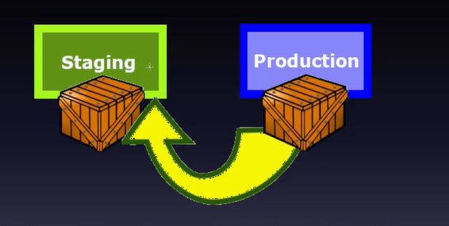

## Blue/Green testing explained

<b>Reveal answer</b>

If things go wrong, go back fast!    The production environment (blue) is exchanged with the staging environment (green) - this may be done by updating a routing table

