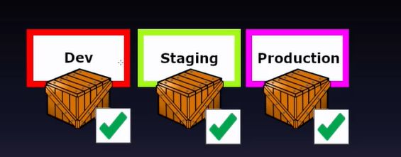

## Done means released&nbsp;&nbsp;a feature is only ""done"" once it has been released to a production-like environment

<b>Reveal answer</b>

Things are either done or are not.  Using estimates leads to recriminations and finger pointing if the predictions are wrong

