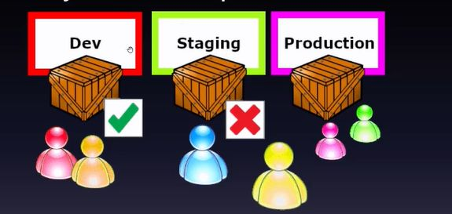

## Everyone is responsible  Ultimately a team succeeds or fails as a team, not as individuals. But Why?

<b>Reveal answer</b>

When something goes wrong, independent teams may spend as much time blaming one another as they do fixing the defects that inevitably arise from a siloed approach

