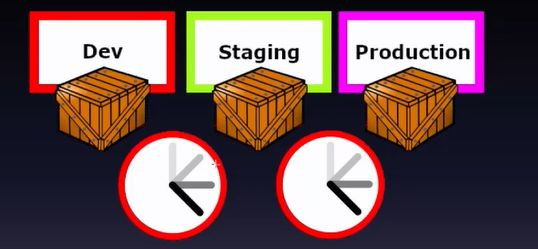

## If it hurts, do it more fequently - if a build is painful, do it on every commit 

<b>Reveal answer</b>

As with any activity, one improve with practice: kinks ironed out and makes it clear when something is going awry If something goes wrong, you have small deployment updates! 

