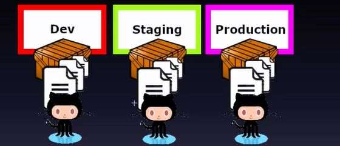

## Version control for everything - documents, scripts, code, libraries. But Why? 

<b>Reveal answer</b>

- If something breaks, you can go back to the exact state. - Build any version of the applciation on demand

