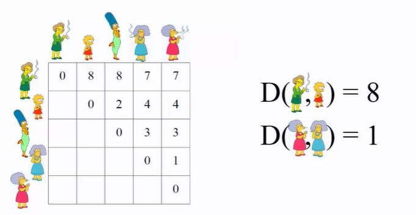

## Agglomerative (bottom up) generation

<b>Reveal answer</b>

Start with distance matrix between our data points Look at every pair, choose the pair that is shortest Treet the pair as a single node and consider all merges Repeat until done  

