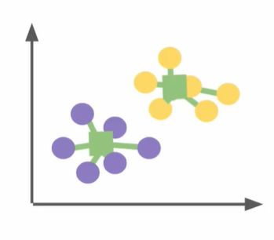

## 4 steps to k means

<b>Reveal answer</b>

1. input n data points and set how many clusters K 2. Choose K random data points to be initial cluster centroids  Repeat until convergence:&nbsp; 3. Assign each data point to the closest centroid 4. Recompute the centroids locations using the current points in each cluster  

