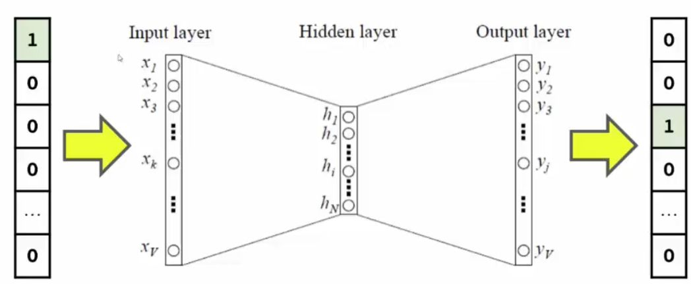
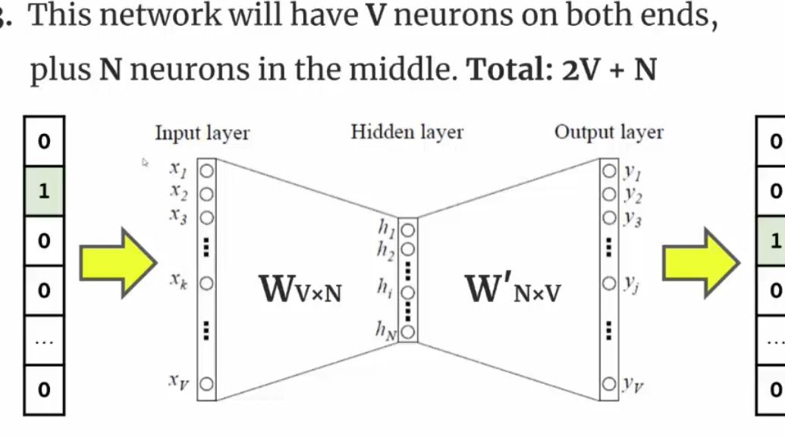
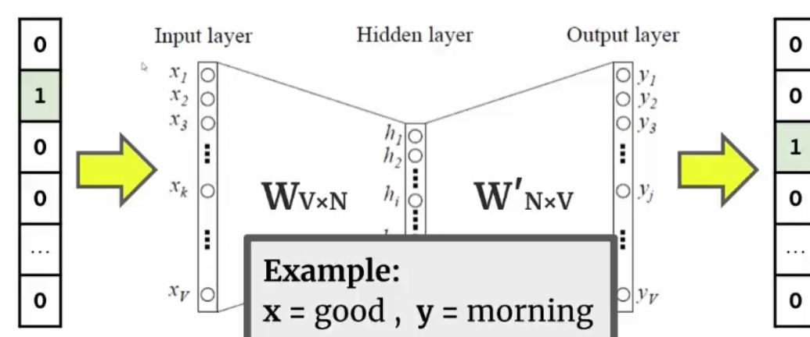
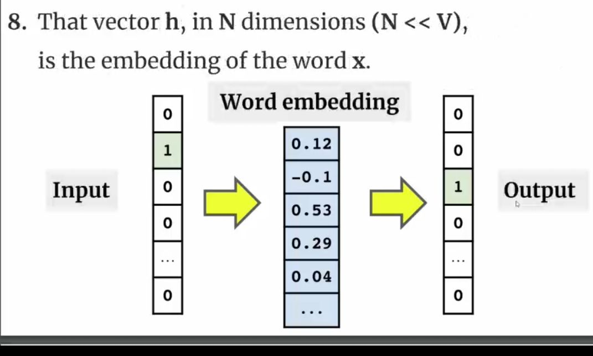

## Steps to word embedding

<b>Reveal answer</b>

1. One-hot vectors representing every word 2. Use those vectors as input to a 2 layer neural letwork 3. Use this neural network to predict the word that comes after the input word. 4. Train the network (fit the weight matrices) 5. Once you finish training, every word will correspond to a vector (hidden layer) which maximised P(y|x)     

