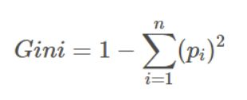
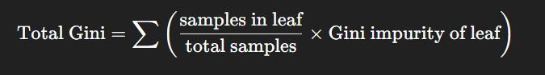
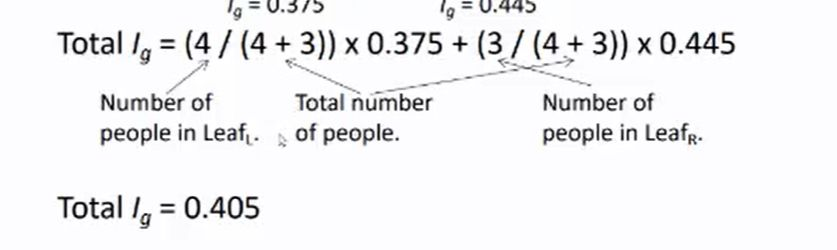

## How do you calculate the total Gini impurity?

<b>Reveal answer</b>

 ig(n) = 1 - SUM[pi^2]   Take the average of Gini impurities for the leaves. total Ig, you times them all via a weighted sum. eg 

