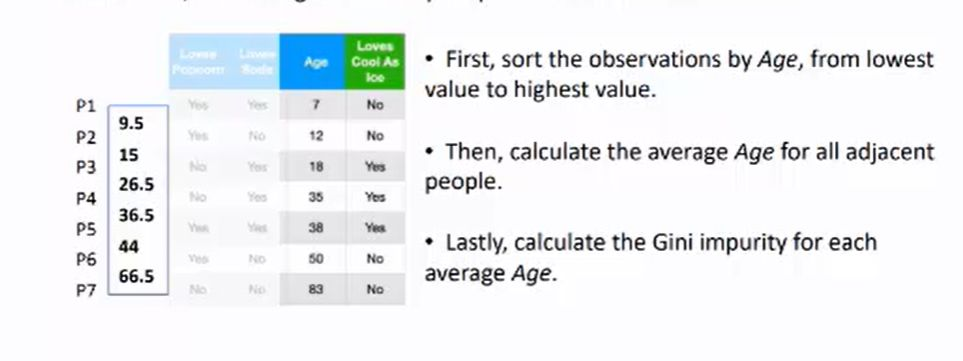

## How to calculate Gini Impurity&nbsp; for numeric data

<b>Reveal answer</b>

Sort from highest to lowest.  Then calculate average for all adjacent people  Then calculate gini impurity for each average  

