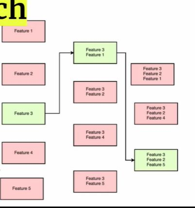

## Forward Search explained (Feature selection)

<b>Reveal answer</b>

1. Create n models, with one feature each 2. Select the best one 3. create n-1 models by adding one feature 4. Select the best one 5. Repeat until you have chosen m features  

