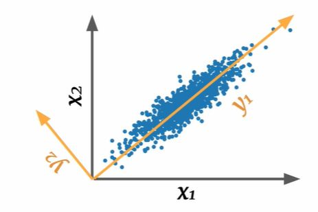

## Principal Component Analysis core idea

<b>Reveal answer</b>

Find an orthogonal coordinate transformation  - Rotation - Rotation and reflection  Such that every new coordinate is maximally informative 

