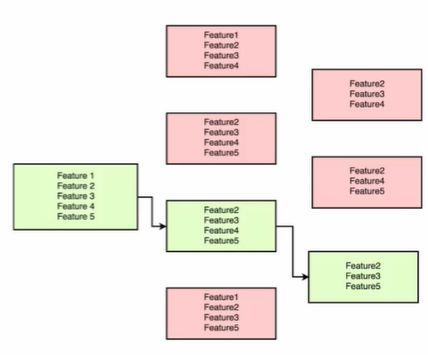

## Recursive Feature Elimination (feature selection)

<b>Reveal answer</b>

1. Create n-1 models, with n-1 features each 2. select the best one 3. Create n-2 models by removing one feature 4. select the best one 5. repeat until you have removed m features  

