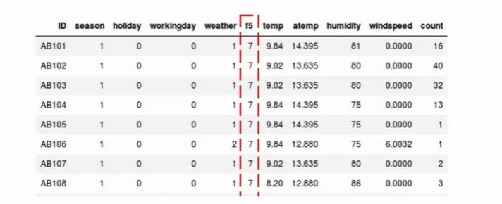

## What is variance thresholding?

<b>Reveal answer</b>

<ul><li>Low varience features contain less informations (e.g. all same number)</li><li>Calculate Variance of each feature, then drop features below some threshold</li><li>First <b>normalise </b>your features!</li></ul>  

