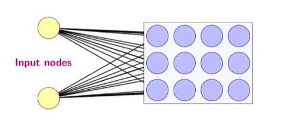

## SOM architectrure

<b>Reveal answer</b>

- As many input nodes as features in the data - Input nodes are connected to a map of interconnected nodes - Every input is connected to every node in the map via weighted edges 

