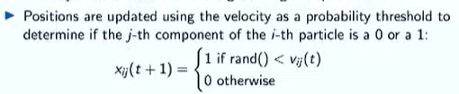
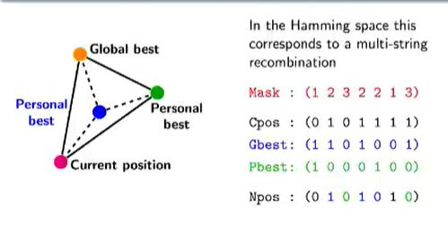

## 2 Binary adaptations for PSO

<b>Reveal answer</b>

1: Discretise at the last minute! Velocity remains consistent  2. Generalise motion to discrete spaces - No explicit velocity Positions are updated by moving the particle towards personal best and global best proportionally to c1 and c2 - use a mask and combine them! 

