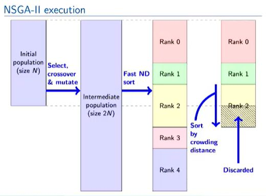

## NSGA-II algorithm explained MAO

<b>Reveal answer</b>

1. create population 2. Select parents, crossover &amp; mutate, create a population of 2N 3. Fast Non dominated sort the parents and the children 4. Sort bottom half group by crowding distance 5. discard bottom half&nbsp;  

