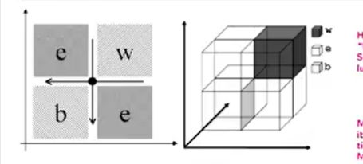

## Three issues with Many objective optimisation (M&gt;= 4)

<b>Reveal answer</b>

1. Problem visualising a high dimensional Pareto front approximation 2. Reduction in the search capability (more 'equal' solutions) 3. Exponential increase in the number of solutions needed to approximate the Pareto front

