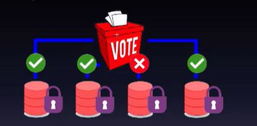

## What is a Two-phase commit explained

<b>Reveal answer</b>

- A coordinator transaction asks participant transactions to vote on whether they are prepared to commit to a change - While waiting for the vote to end, Each participant holds locks on its data. - If one says no, then no commit is made by the coordinator and they all abort Slow things down! everyone has to wait!  

