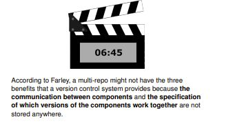

## According to Farley, why do the solutions to the multi-repo problem have the three benefits that a version control system provides?  The problem:  The solutions 

<b>Reveal answer</b>

It's possible to 1. Step back to safety (by stepping back any component) 2. Share changes easily (by coordinating updates - not easy) 3. Store changes somewhere safe (by storing compoinents separately

