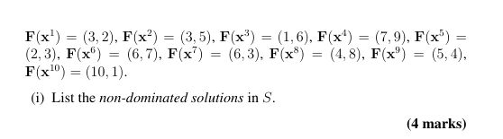
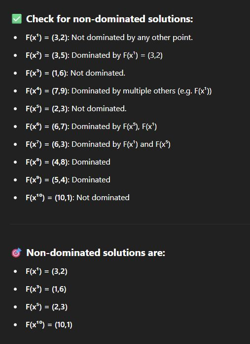

## 

<b>Reveal answer</b>

 <strong>Never use the sum of objectives</strong> to determine dominance unless you're explicitly converting it into a <strong>single-objective problem!!! </strong> 
A point <strong>A dominates</strong> point <strong>B</strong> if:
 <ul> <li> 
A is <strong>no worse</strong> than B in <strong>all objectives</strong>, and
 </li> <li> 
A is <strong>strictly better</strong> than B in <strong>at least one</strong>
</li></ul>

