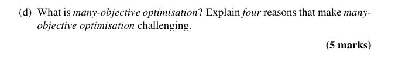

## 

<b>Reveal answer</b>

<h3>🧠 <strong>Flashcard: Many-Objective Optimisation</strong></h3> 
<strong>Definition:</strong>  Many-objective optimisation deals with problems involving <strong>four or more objectives</strong>, making it harder than traditional multi-objective optimisation.
 
<strong>Why it's challenging:</strong>
 <ol> <li> 
<strong>Hard to visualise</strong> high-dimensional Pareto fronts.
 </li> <li> 
<strong>Too many non-dominated solutions</strong> weakens selection pressure.
 </li> <li> 
<strong>More solutions needed</strong> to represent the front = high computational cost. (exponential)
 </li> <li> 
<strong>Maintaining diversity</strong> becomes difficult in high-dimensional spaces.
 </li> </ol> 
Would you like a quiz-style flashcard version too?

