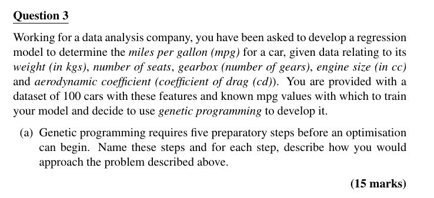

## 

<b>Reveal answer</b>

<ol><li>
<strong>Terminal Set</strong>

Inputs &amp; constants used by programs.  ➤ <em>Use car features: weight, seats, gears, engine size, drag (cd) + random constants.</em>
 </li> <li> 
<strong>Function Set</strong>  Operators that combine inputs.  ➤ *Use {+, -, <em>, /}; optionally add log, sin, etc. for complexity.</em>
 </li> <li> 
<strong>Fitness Measure</strong>  Evaluates program accuracy.  ➤ <em>Use error between predicted and actual mpg (e.g., sum of squared errors).</em>
 </li> <li> 
<strong>Run Parameters</strong>  Controls evolution.  ➤ <em>Set population size, mutation/crossover rate, max depth, etc.</em>
 </li> <li> 
<strong>Stopping Criterion</strong>  When evolution ends.  ➤ <em>Stop after fixed generations or when error drops below a threshold.</em>
</li></ol>

