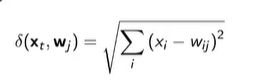
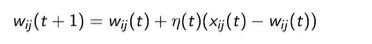

## Learning algoirthm of Self Organising Maps

<b>Reveal answer</b>

1. Initialise network - Set weights to small random values - Define large neighbourhood size  Repeat until converges:&nbsp; 2. Sample random input (xt) from the data and input to the network 3. Compute the Euclidean distance of each output node j's weights from the current input using  d(xt, wj) = root[ SUM [ (xi-wij)^2 ] ]    4. Identify the node closest to the input (the best matching unit - BMU) 5. Adjust the weights of the BMU and its neighbours with wij(t+1) = wij(t) + n(t)(xij(t) - wij(t)) 

