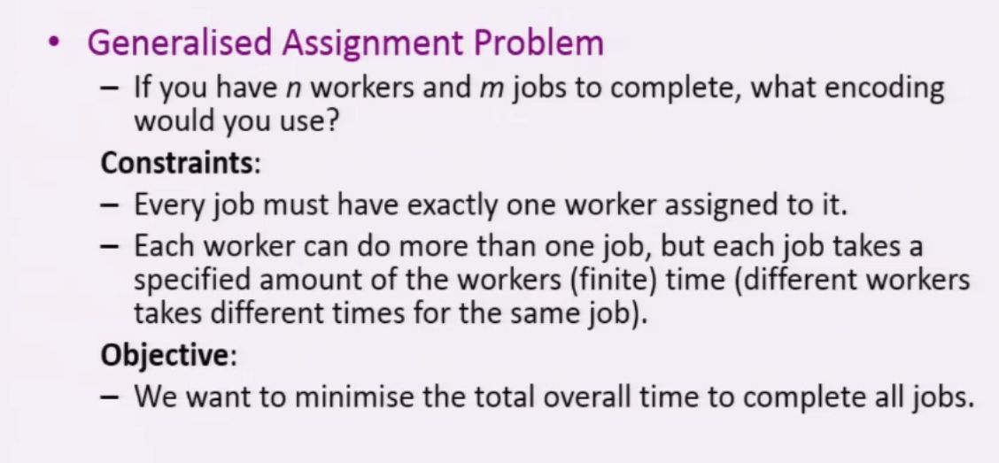

## What are two potential encodings for the following

<b>Reveal answer</b>

1. n intergers (workers), each with range 1-m (jobs) - workers cant have multiple jobs! 2. m integers (jobs) each with a range 1-n (workers)

