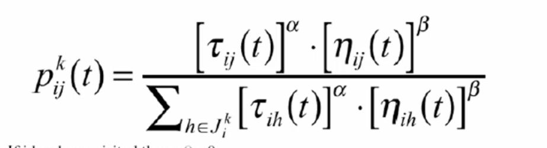

## Explain the transition rule in plain english:&nbsp;

<b>Reveal answer</b>

probability of ant k moving from city i to j (on t'th tour) is  pheromone positive feedback * local information&nbsp; divided by sum of all possible moves pheromone feedback * local information

