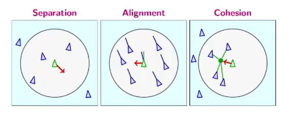

## Craig Reynold's Boids model (1987) 3 rules

<b>Reveal answer</b>

1. Separation - steer to avoid crowding local flockates 2.&nbsp; Alignment/Velocity matching: steer towards the average heading of flockmates 3. Cohesion -- Steer to move toward the average position of local flockmates  

