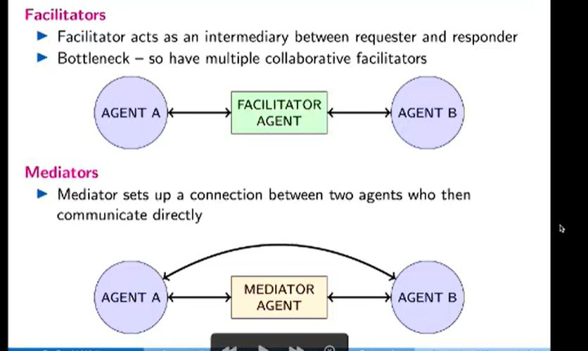

## 2 types of Middle Agents

<b>Reveal answer</b>

Facilitators: - Intermediary between requester and responder - Bottleneck, so habe multiple  Mediators: - Sets up a connections between two agents then communicate directly  

