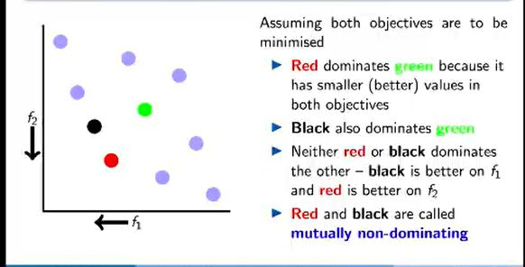

## Domination Criterion: What would mean solution A dominates solution B?

<b>Reveal answer</b>

A solution A dominates another B in the population, if it is at least as good as B on every objective, and better than B on at least one objective  

