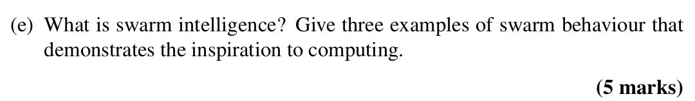

## 

<b>Reveal answer</b>

<strong>What is Swarm Intelligence?</strong>
 <ul> <li> 
Collective, self-organized behavior from simple individuals.
 </li> <li> 
No central control; intelligence emerges from local interactions.
 </li> </ul> 
<strong>Examples (inspired computing):</strong>
 <ol> <li> 
<strong>Ant Foraging → Ant Colony Optimisation (ACO)</strong>
 <ul> <li> 
Ants find shortest paths using pheromones.
 </li> </ul> </li> <li> 
<strong>Bird Flocking/Fish Schooling → Particle Swarm Optimisation (PSO)</strong>
 <ul> <li> 
Individuals adjust based on neighbors' position and movement.
 </li> </ul> </li> <li> 
<strong>Slime Mold</strong>
 <ul> <li> 
Slime mold: Forms paths to food → inspires pathfinding algorithms. 
</li> </ul> </li></ol>

