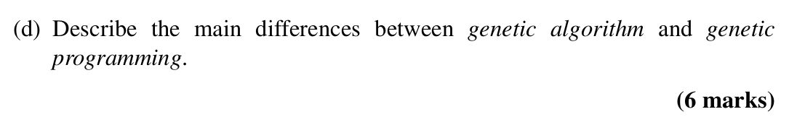

## 

<b>Reveal answer</b>

<strong>1. What They Evolve</strong>
 <ul> <li> 
<strong>GA:</strong> Solutions (e.g., strings, vectors).
 </li> <li> 
<strong>GP:</strong> Programs (tree structures).
 </li> </ul> 
<strong>2. Representation</strong>
 <ul> <li> 
<strong>GA:</strong> Linear array-likes (bit strings, numbers).
 </li> <li> 
<strong>GP:</strong> Trees (functions + terminals).
 </li> </ul> 
<strong>3. Fitness Evaluation</strong>
 <ul> <li> 
<strong>GA:</strong> Based on solution performance.
 </li> <li> 
<strong>GP:</strong> Run program on test cases and measure output.
 </li> </ul> 
<strong>4. Genetic Operators</strong>
 <ul> <li> 
<strong>GA:</strong> Point/Uniform crossover, bit mutation.
 </li> <li> 
<strong>GP:</strong> Subtree crossover and mutation.
 </li></ul>

