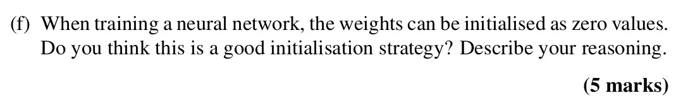

## 

<b>Reveal answer</b>

<h3><strong>Flashcard: Is Zero Initialization Good for Neural Networks?</strong></h3> 
<strong>Short Answer:</strong> ❌ <strong>No, it's a bad idea.</strong>
 
<strong>Why?</strong>
 <ul> <li> 
All neurons start the same → do the same computation.
 </li> <li> 
Get same gradients → update the same way (same error)
 </li> <li> 
❗ No learning diversity = wasted neurons.
</li></ul>

