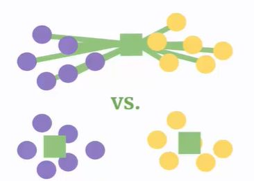

## How to measure distance between clusters? 5 methods.

<b>Reveal answer</b>

Simple linkage - use two closest members (may make long clusters of short links)  Complete linkage - use the largest distance between members (tends to break large clusters into 2 or more)  Average linkage: take the average distance (a lot of comparisons!)  Centroid linkage: use the centroid distance between the clusters (biased toward spherical clusters)  Ward's method: join clusters only if it reduces the total distance from the centroids 

